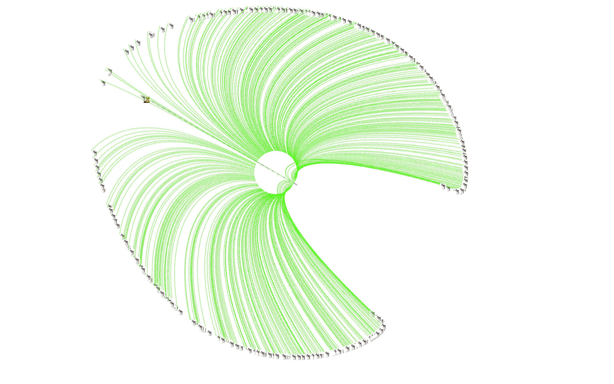
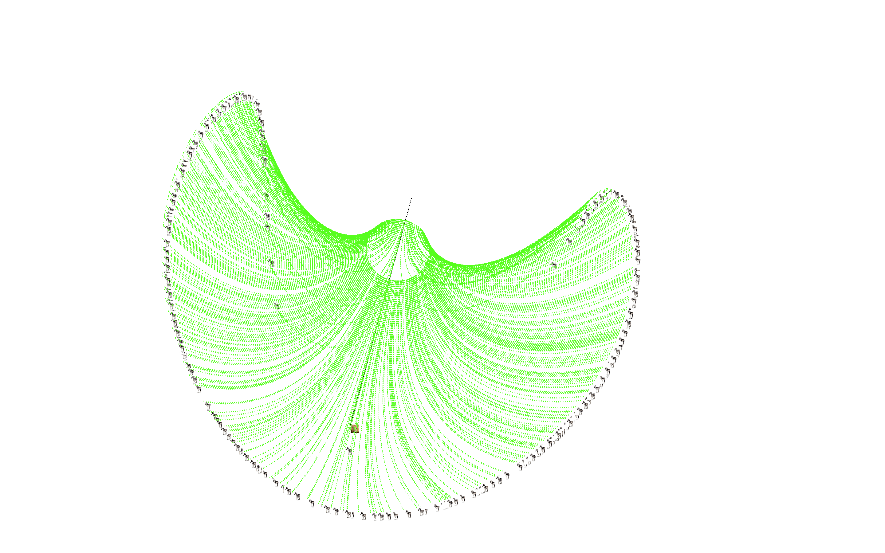
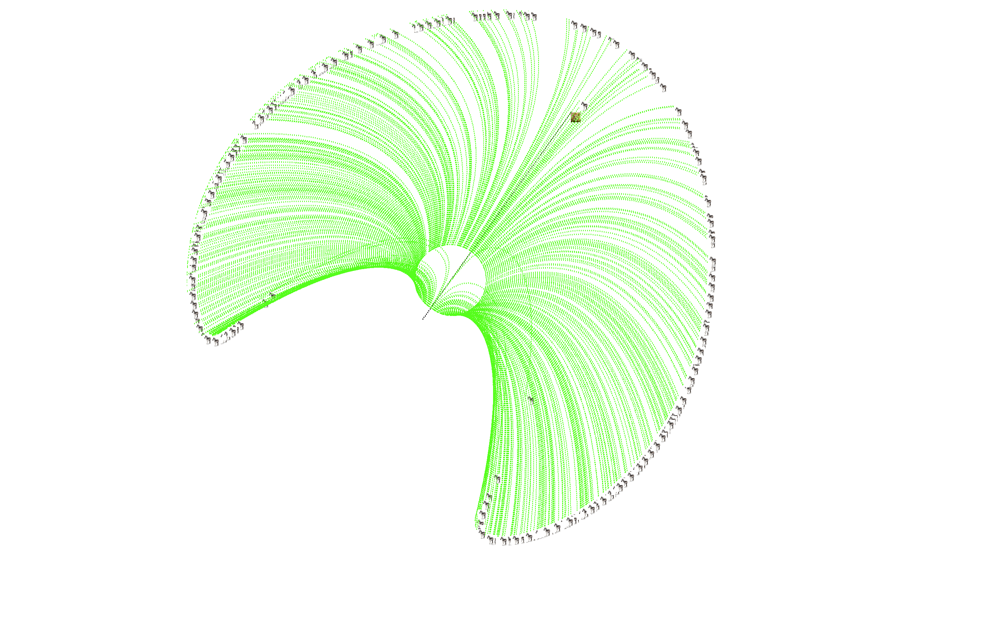
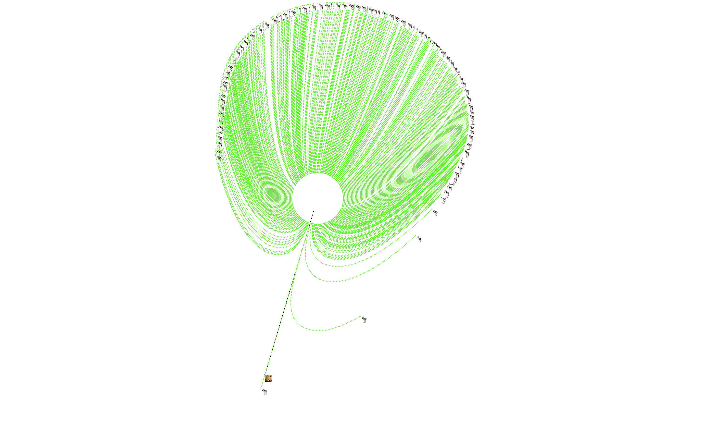
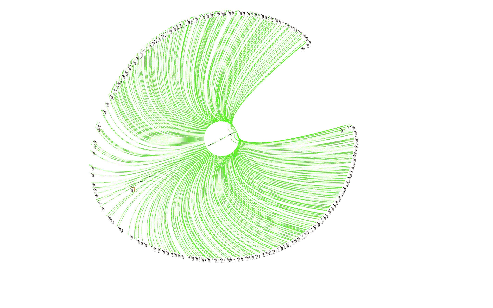

# Lion Zebra Simulation

You are a Lion and your goal is to eat as many Zebras as possible. When all Zebras go out of the screen, the simulation is over, press ESC to exit the program.

Use 
```
python run.py
```
 to run the simulation, you need PyGame installed in your system.

If zebras are concyclic at the beginning, here's some examples:






